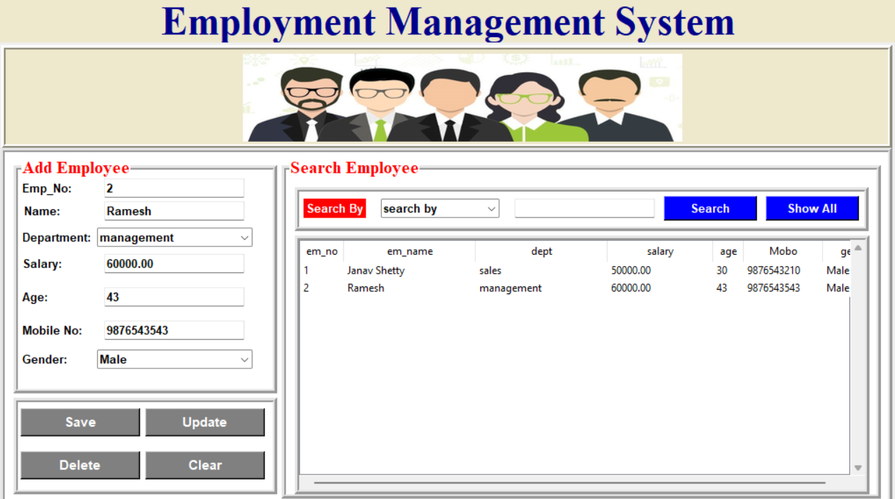

# Employee Management System

## Overview

The Employee Management System is a comprehensive solution for managing employee data. It includes features for adding, updating, deleting, and searching employee information. The system is built using Python's Tkinter library for the GUI and MySQL for the database.  





## Features

- Add new employees
- Update existing employee information
- Delete employee records
- Search for employees by various criteria
- User-friendly interface

## Prerequisites

Before you begin, ensure you have met the following requirements:

- Python 3.x installed on your machine
- MySQL server installed and running
- Necessary Python libraries installed (`mysql-connector-python`, `Pillow`, `tkinter`)

## Installation

1. **Clone the Repository**

    ```bash
    git clone https://github.com/Janav20/EmpoSys-Employement-Management-System.git
    cd EmpoSys-Employement-Management-System-main
    ```

2. **Set Up the Database**

    - Open MySQL Workbench or your preferred MySQL command-line tool.
    - Create a database named `gui`.

    ```sql
    CREATE DATABASE gui;
    USE gui;
    ```

    - Create the `employee` table.

    ```sql
    CREATE TABLE employee (
        em_no INT PRIMARY KEY,
        name VARCHAR(100),
        dept VARCHAR(100),
        salary DECIMAL(10, 2),
        age INT,
        mobo VARCHAR(15),
        gender VARCHAR(10)
    );
    ```

3. **Install Required Libraries**

    ```bash
    pip install mysql-connector-python Pillow
    ```

## Running the Application

1. **Navigate to the Project Directory**

    ```bash
    cd path/to/your/project/directory
    ```

2. **Run the Application**

    ```bash
    python main.py
    ```

## Usage

- Use the form fields to enter employee data.
- Click "Save" to add a new employee.
- Select an employee from the table to update or delete their information.
- Use the search functionality to find employees by specific criteria.


## Contact

If you have any questions or suggestions, please feel free to contact me at [shettyjanav@gmail.com](shettyjanav@gmail.com).
